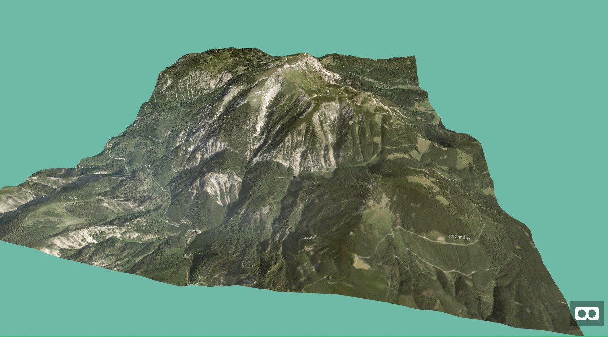

## aframe-tangram-terrain-component

A [Tangram](https://github.com/tangrams/tangram) terrain component for [A-Frame](https://aframe.io). 

> Supports A-Frame 0.8.0.



### API

#### `tangram-terrain` component

This component obtains a heightmap from the [Amazon public dataset S3](https://aws.amazon.com/public-datasets/terrain/) servers and applies a overlay texture according the `style` specification. The heightmap is used as a `displacement` map and so is used in conjunction with GPU picking technique to obtain fast results.

_Note that no bathymetry data is included!_

##### Schema
| Property | Description | Default Value |
| -------- | ----------- | ------------- |
| apiKey | Sets the global API key of the overlay map. May be empty if the style needs no API. | "" |
| style | The style definition document for the ovleray style. Must point to a custom style or to a [basemap style](https://www.nextzen.org/). May need an API key set. | "" |
| center | Center of the map, in the form of [longitude, latitude] | [0, 0] |
| zoom | The zoom level of the map. | 13 |
| pxToWorldRatio | The multiplication factor between meters in A-Frame and the pixels of the map. ie; when set to 100, will display 100 pixels per 1 meter in world space. (see [a note on fidelity](#a-note-on-fidelity)) | 100 |
| depthBuffer | Renders a depth buffer to an external scene, so that you can get the height from the terrain by GPU picking. Set to _false_ for performance reasons if you do not need it. | false |
| dispose | Disposes the _Tangram_ instance after creating the terrain to free up memory. Set to _false_ if you need to modify the terrain via the _Leaflet_ API. | true |
| lod | Level-Of-Detail. Between 1 and 0.1. Multiplicaiton Factor of Overlay and Heightmap pixels. If you modify during runtime to not dispose the instance. | 1 |

##### Events
| Name | Data | Description |
| -------- | ----------- | ------------- |
| tangram-terrain-loaded | None| Fired when the terrain that means the elevation data and the overlay map has finished loading or the corresponding Level-Of-Detail has been loaded. Only by then the public API will be usable. |


##### API
| Name | Data | Description |
| -------- | ----------- | ------------- |
| project | _lon_, _lat_| Returns the pixel x and y and z (depth) coordinates of the given longitude and latitude. |
| unproject | _x_, _y_| Gives the longitude and latitude of the world coordinates. |
| unprojectHeight | _x_, _y_| Gives the depth value (GPU picked from the heightmap) from the pixel coordinates, only if the `depthBuffer` value is set to _true_. Value is scaled according to the `displacementScale` scale and added the `displacementBias` value. To obtain real height values |
| unprojectHeightInMeters | _x_, _y_| Gives the height value in meters. No exact values are possible though. Range between 0 and 8900 (Mount Everest) |
| renderDepthBuffer | | Renders the heightmap depth buffer. Needs to be only called manually if the heigtmap is changed programmtically |

### Styling
The Tangram map is styled within a (set) of YAML files. See the [Tangram documentation](https://mapzen.com/documentation/tangram/) for details. 

### A note on fidelity

The higher `pxToWorldRatio`, the more map area will be displayed per world
unit. That canvas has to be translated into a plane in world space. This is
combined with the width and height in world space (from geometry.width and
geometry.height on the entity) to set up the plane for rendering in 3D.

The map is rendered as a texture on a 3D plane. For best performance, texture
sizes should be kept to powers of 2. Keeping this in mind, you should work to
ensure `width * pxToWorldRatio` and `height * pxToWorldRatio` are powers of 2.

### Dependencies
The Mapzen styling documents are in the YAML format, so you need a possiblity to require those files.
If you are using _Webpack_ install
`npm install yml-loader --save-dev` 
and configure the webpack configuration file

If you are using browserify install the
`nmp install yamlify --save-dev` 
and give pass the transform (-t) parameter to browserify.

### Installation

#### Browser

Install and use by directly including the [browser files](dist):

```html
<head>
  <title>My A-Frame Scene</title>
  <script src="https://aframe.io/releases/0.8.0/aframe.min.js"></script>
  <script src="https://unpkg.com/aframe-tangram-terrain-component/dist/aframe-tangram-terrain-component.min.js"></script>
</head>

<body>
  <a-scene>

    <a-tangram-terrain
      zoom="10" 
      center="15.8056, 7.7671" 
      map-style="#yamlElevation" 
      px-world-ratio="12"
      visible="true" wireframe="false" height-scale="40"
      width="25" depth="25">
    </a-tangram-terrain>
  </a-scene>
</body>
```

<!-- If component is accepted to the Registry, uncomment this. -->
<!--
Or with [angle](https://npmjs.com/package/angle/), you can install the proper
version of the component straight into your HTML file, respective to your
version of A-Frame:

```sh
angle install aframe-tangram-terrain-component
```
-->

#### npm

Install via npm:

```bash
npm install aframe-tangram-terrain-component
```

Then require and use.

```js
require('aframe');
require('aframe-tangram-terrain-component');
```

#### Required step for Webpack
To get the import working you need to tell _Webpack_ not to parse the _Tangram_ library otherwise you will run into [this error](https://github.com/tangrams/tangram/issues/559). So you need to add this in your _webpack.config.js_.

```js
module: {
    noParse: [/tangram\/dist\/tangram/],
}
```

See also [here](https://github.com/tangrams/tangram-play/wiki/Advanced-Tangram-for-front-end-engineers:-bundlers,-frameworks,-etc) for more information.


### Known issues
* The maximum texture size (configured by the _pxToWorldRatio_ and _size_ parameters of the overlay map is restricted on mobile devies.  
* The Tangram library only allows [one instance on a page] (https://github.com/tangrams/tangram/issues/350) that means a tiling algorithm cannot instance terrain entities in parallel! Hopefully this restriction may fall in the future.
* 
